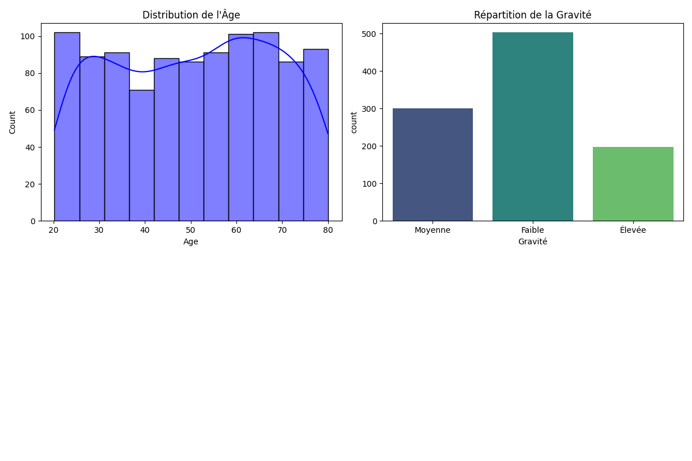
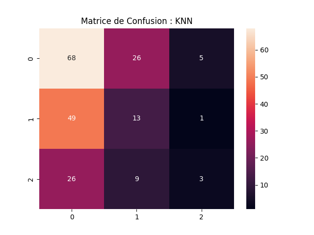

## 📝 Description du Projet
Ce projet a été réalisé dans le cadre du module **Introduction à l'Intelligence Artificielle** sous la direction du **Prof. Faouzi Marzouki**. L'objectif est de concevoir un pipeline complet de Machine Learning, allant de la génération de données synthétiques à l'évaluation de modèles de classification.

## 🚀 Fonctionnalités
- **Génération de données :** Création d'un dataset de 300 patients basé sur des lois statistiques (Normale, Uniforme, Bernoulli).
- **Analyse Exploratoire :** Visualisation des distributions (Âge, Pression Artérielle, Gravité).
- **Machine Learning :** Implémentation et comparaison de 4 modèles :
  - K-Nearest Neighbors (KNN)
  - Perceptron
  - Naive Bayes
  - Neural Network (MLP)
- **Évaluation :** Analyse via matrices de confusion et diagrammes de Kiviat (Radar Plot).

## 📊 Visualisations
Voici quelques résultats générés par le script :

### 1. Distribution des Données

*Cette figure montre la répartition équilibrée des caractéristiques des patients.*

### 2. Évaluation des Modèles (Matrices de Confusion)

*Comparaison de la précision des prédictions pour chaque classe de gravité.*

## 🛠️ Installation et Utilisation
1. Clonez le dépôt :
   ```bash
   git clone [https://github.com/israanao3-a11y/apprentissage_automatique.git](https://github.com/israanao3-a11y/apprentissage_automatique.git)
